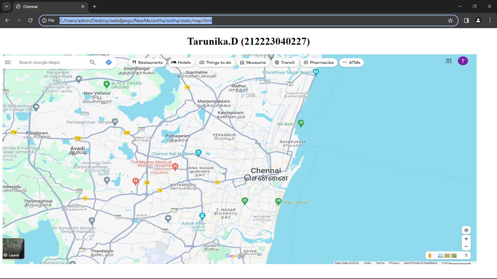
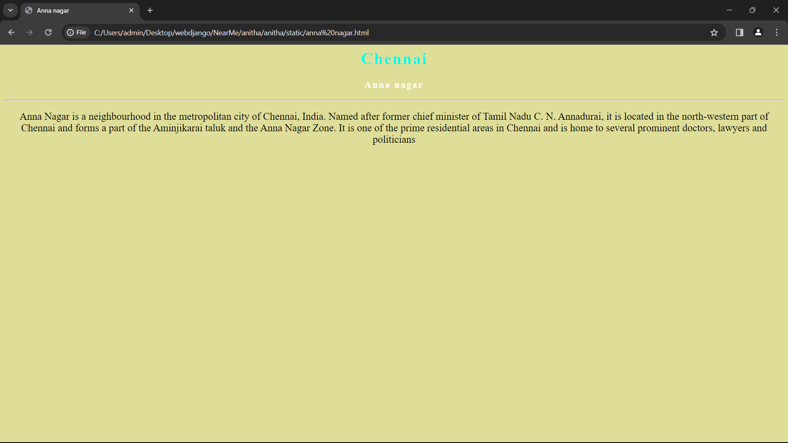
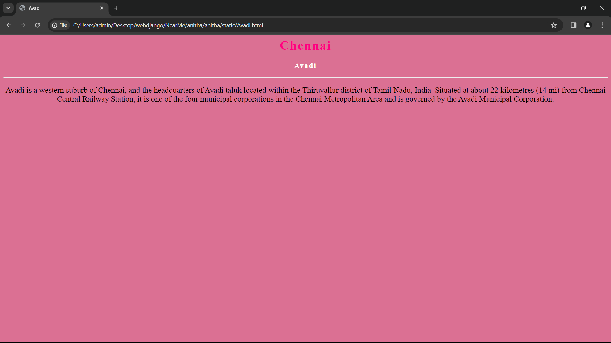
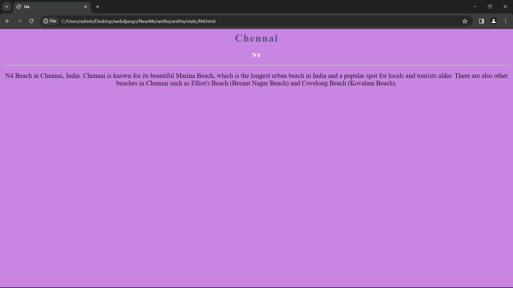
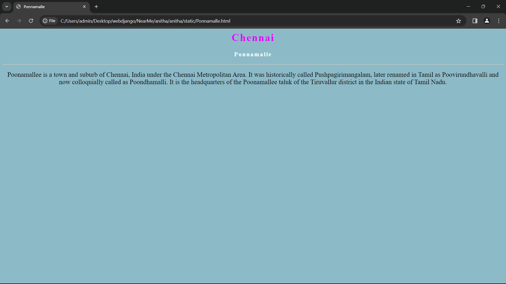
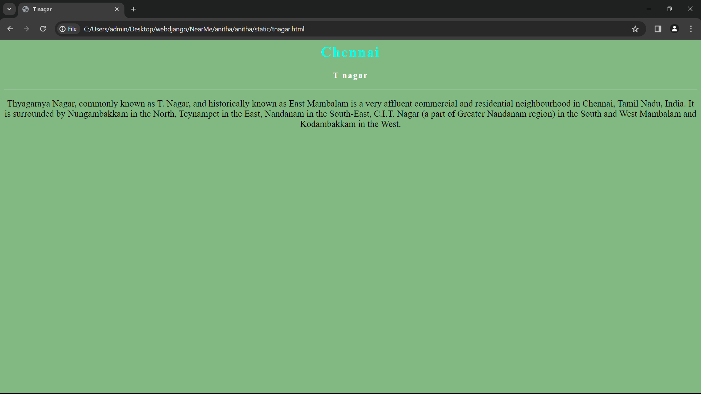

# Ex04 Places Around Me
## Date: 

## AIM
To develop a website to display details about the places around my house.

## DESIGN STEPS

### STEP 1
Create a Django admin interface.

### STEP 2
Download your city map from Google.

### STEP 3
Using ```<map>``` tag name the map.

### STEP 4
Create clickable regions in the image using ```<area>``` tag.

### STEP 5
Write HTML programs for all the regions identified.

### STEP 6
Execute the programs and publish them.

## CODE
```
<!DOCTYPE html>
<html>
<head>
    <title>Chennai</title>
</head>
<body>
    <h1 align="center">
    <font color="black"><b>Tarunika.D (212223040227)</b></font>
    </h1>
    
    <map name="workmap">
        <area shape="circle" coords="200,300,30" alt="Avadi" href="Avadi.html">
        <area shape="circle" coords="950,250,30" alt="N4" href="N4.html">
        <area shape="circle" coords="600,350,30" alt="Anna nagar" href="anna nagar.html">
        <area shape="circle" coords="700,450,30" alt="t nagar" href="tnagar.html">
        <area shape="circle" coords="170,500,30" alt="ponnamalle" href="Ponnamalle.html">
    </map>
</body>
</html>
```
```
<html>
    <head>
        <title>Anna nagar</title>
    </head>
    <body style="background-color: rgb(223, 222, 153);">
        <center>
            <h1 style="color: rgb(0, 255, 234);letter-spacing: 2px;">Chennai</h1>
            <h3 style="color: white; letter-spacing: 2px;">Anna nagar</h3>
            <hr>
            <p style="font-size: 20px;">Anna Nagar is a neighbourhood in the metropolitan city of Chennai, India. Named after former chief minister of Tamil Nadu C. N. Annadurai, it is located in the north-western part of Chennai and forms a part of the Aminjikarai taluk and the Anna Nagar Zone. It is one of the prime residential areas in Chennai and is home to several prominent doctors, lawyers and politicians</p>
        </center>
    </body>
</html>

```

```
<html>
    <head>
        <title>Avadi</title>
    </head>
    <body style="background-color: palevioletred;">
        <center>
            <h1 style="color: rgb(255, 0, 128);letter-spacing: 2px;">Chennai</h1>
            <h3 style="color: white; letter-spacing: 2px;">Avadi</h3>
            <hr>
            <p style="font-size: 20px;">Avadi is a western suburb of Chennai, and the headquarters of Avadi taluk located within the Thiruvallur district of Tamil Nadu, India. Situated at about 22 kilometres (14 mi) from Chennai Central Railway Station, it is one of the four municipal corporations in the Chennai Metropolitan Area and is governed by the Avadi Municipal Corporation.</p>
        </center>
    </body>
</html>
```
```
<html>
    <head>
        <title>N4</title>
    </head>
    <body style="background-color: rgb(201, 133, 226);">
        <center>
            <h1 style="color: rgb(86, 78, 141);letter-spacing: 2px;">Chennai</h1>
            <h3 style="color: white; letter-spacing: 2px;">N4</h3>
            <hr>
            <p style="font-size: 20px;">N4 Beach in Chennai, India. Chennai is known for its beautiful Marina Beach, which is the longest urban beach in India and a popular spot for locals and tourists alike. There are also other beaches in Chennai such as Elliot's Beach (Besant Nagar Beach) and Covelong Beach (Kovalam Beach). </p>
        </center>
    </body>
</html>
```
```
<html>
    <head>
        <title>Ponnamalle</title>
    </head>
    <body style="background-color: rgb(141, 186, 199);">
        <center>
            <h1 style="color: rgb(225, 0, 255);letter-spacing: 2px;">Chennai</h1>
            <h3 style="color: white; letter-spacing: 2px;">Ponnamalle</h3>
            <hr>
            <p style="font-size: 20px;">Poonamallee is a town and suburb of Chennai, India under the Chennai Metropolitan Area. It was historically called Pushpagirimangalam, later renamed in Tamil as Poovirundhavalli and now colloquially called as Poondhamalli. It is the headquarters of the Poonamallee taluk of the Tiruvallur district in the Indian state of Tamil Nadu.</p>
        </center>
    </body>
</html>
```
```
<html>
    <head>
        <title>T nagar</title>
    </head>
    <body style="background-color: rgb(130, 185, 130);">
        <center>
            <h1 style="color: rgb(0, 255, 234);letter-spacing: 2px;">Chennai</h1>
            <h3 style="color: white; letter-spacing: 2px;">T nagar</h3>
            <hr>
            <p style="font-size: 20px;"> Thyagaraya Nagar, commonly known as T. Nagar, and historically known as East Mambalam is a very affluent commercial and residential neighbourhood in Chennai, Tamil Nadu, India. It is surrounded by Nungambakkam in the North, Teynampet in the East, Nandanam in the South-East, C.I.T. Nagar (a part of Greater Nandanam region) in the South and West Mambalam and Kodambakkam in the West.</p>
    </body>
</html>
```


## OUTPUT







## RESULT
The program for implementing image maps using HTML is executed successfully.
